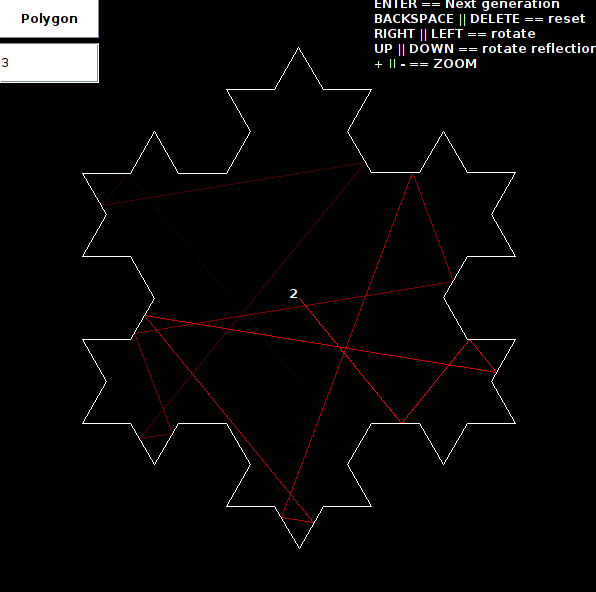

# Koch Snowflake Fractal Visualizer

This project is a **Java** **Swing** application developed using **Maven** in **NetBeans** IDE, designed to visualize the **Koch snowflake fractal**. The program provides an interactive interface for users to explore the fractal in different modes and manipulate its display and visualize it's internal reflection.
Based on this video from The Coding Train:
    Coding Challenge #129: Koch Fractal Snowflake - https://www.youtube.com/watch?v=X8bXDKqMsXE

  

## Features

- **Fractal Visualization**: View the Koch snowflake fractal either as a line or as a regular polygon.
- **Polygon Mode**: Users can define the number of vertices to create polygons for fractal visualization.
- **Interactive Controls**:
  - **Backspace**: Resets the fractal.
  - **Left/Right Arrows**: Rotates the fractal image.
  - **Up/Down Arrows**: Rotates the angle of reflection.
  - **+ / -**: Zoom in and out.
  - **Enter**: Generates the next iteration of the fractal.

## Getting Started

### Prerequisites

- Java Development Kit (JDK)

### Running the Application

-  Execute the `.jar` file, or open the projects in Netbeans.
